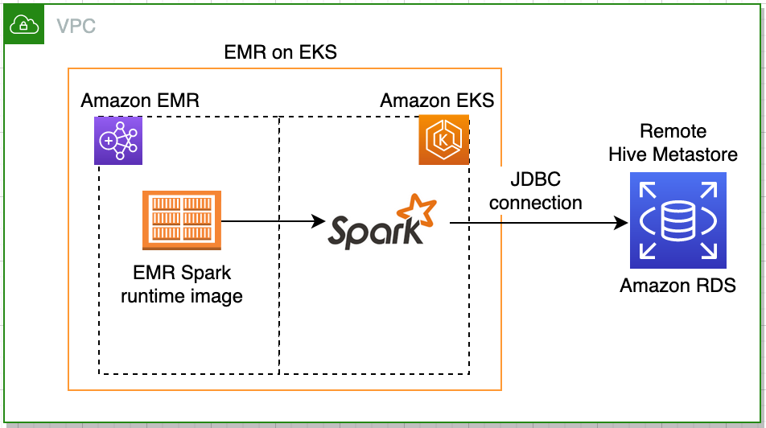
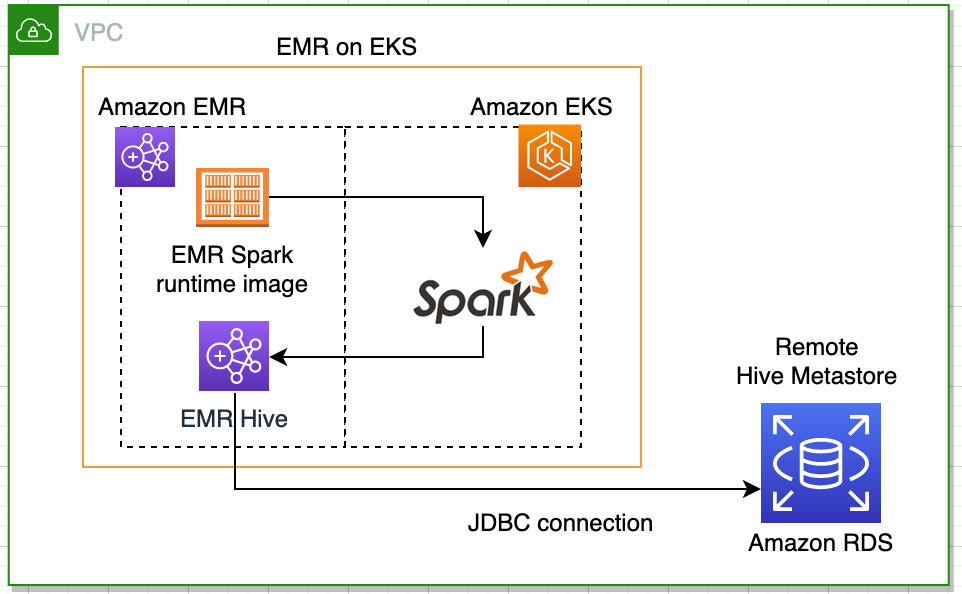
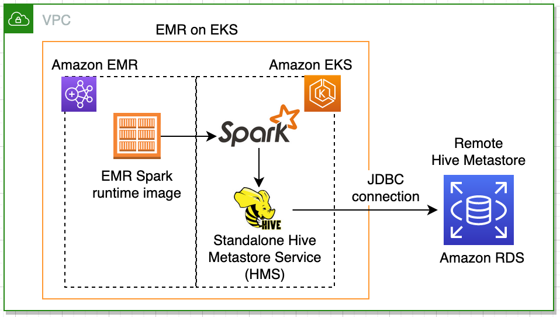
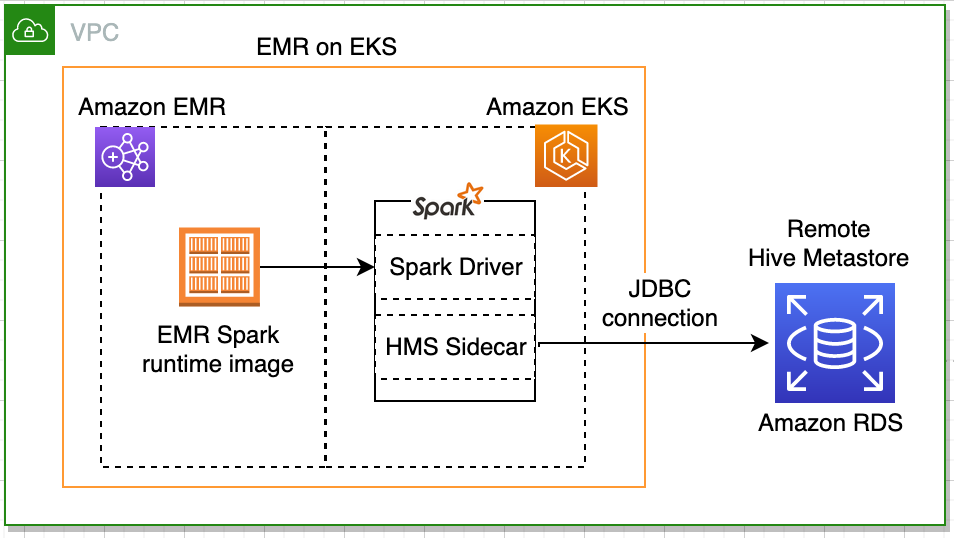
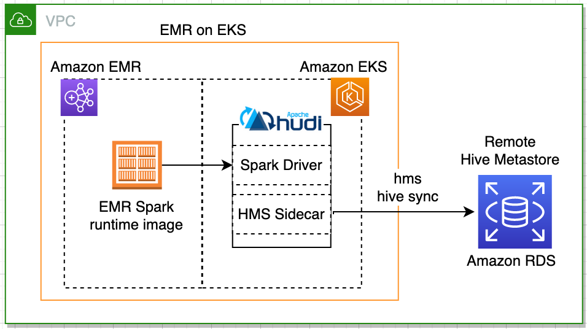
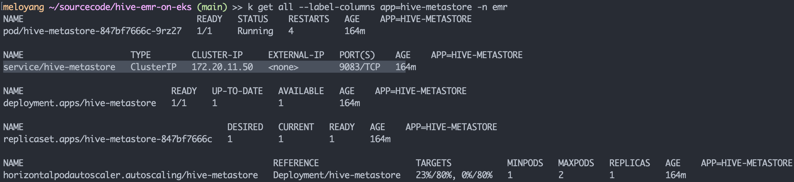

# RDS as Hive metastore for EMR on EKS

This is a project developed in Python [CDKv2](https://docs.aws.amazon.com/cdk/latest/guide/home.html).
It includes few Spark examples that create external hive tables on top of sample dataset stored in S3. These jobs will run with EMR on EKS. 

The infrastructure deployment includes the following:
- A new S3 bucket to store sample data and job code
- An EKS cluster in a new VPC across 2 AZs
- A RDS Aurora database (MySQL engine) in the same VPC
- A small EMR on EC2 cluster in the same VPC
    - 1 master & 1 core node (m5.xlarge)
    - use master node to query the remote hive metastore database
- An EMR virtual cluster in the same VPC
    - registered to `emr` namespace in EKS
    - EMR on EKS configuration is done
    - Connect to RDS and initialize metastore schema via schematool
- A standalone Hive metastore service (HMS) in EKS
    - Helm Chart [hive-metastore-chart](./hive-metastore-chart) is provided.
    - run in the same `emr` namespace
    - thrift server is provided for client connections
    - doesn't initialize/upgrade metastore schemas via schematool
    
# Spark Examples
* [1. Connect remote Hive metastore via JDBC](#11-connect-hive-metastore-via-jdbc) 
* [2. Connect Hive via EMR on EC2](#21-connect-hive-metastore-via-thrift-service-hosted-on-emr-on-ec2) 
* [3. Connect Hive via EMR on EKS](#31-connect-hive-metastore-via-thrift-service-hosted-on-eks)
* [4. Connect Hive via hms sidecar](#41-run-the-thrift-service-as-a-sidecar-in-spark-drivers-pod)
* [5. Hudi with hms sidecar](#43-hudi--remote-hive-metastore-integration)
* [6. Hudi with Glue catalog](#44-hudi--glue-catalog-integration)
* [7. Run Hive SQL with EMR on EKS](#45-run-hive-sql-with-emr-on-eks)

# Key Artifacts
- **Job source code** - [deployment/app_code/job](deployment/app_code/job).
- **HMS sidecar pod** template - [deployment/app_code/job/sidecar_hms_pod_template.yaml](deployment/app_code/job/sidecar_hms_pod_template.yaml).
- **Standalone hive-metastore docker image** - Follow the [README instruction](./docker) to build your own. Don't forget to update your sidecar pod template or helm chart value file with your own ECR URL.

## Deploy Infrastructure

The provisioning takes about 30 minutes to complete. 
Two ways to deploy:
1. AWS CloudFormation template (CFN) 
2. [AWS Cloud Development Kit (AWS CDK)](https://docs.aws.amazon.com/cdk/latest/guide/home.html).

### Prerequisites 
Install the folowing tools:
1. [AWS CLI](https://docs.aws.amazon.com/cli/latest/userguide/install-cliv2.html). Configure the CLI by `aws configure`.
2. [kubectl & jq](https://www.eksworkshop.com/020_prerequisites/k8stools/)

Can use [AWS CloudShell](https://console.aws.amazon.com/cloudshell) that has included all the neccessary software for a quick start.

### CloudFormation Deployment

  |   Region  |   Launch Template |
  |  ---------------------------   |   -----------------------  |
  |  ---------------------------   |   -----------------------  |
  **US East (N. Virginia)**| [](https://console.aws.amazon.com/cloudformation/home?region=us-east-1#/stacks/quickcreate?stackName=HiveEMRonEKS&templateURL=https://blogpost-sparkoneks-us-east-1.s3.amazonaws.com/hive-emr-on-eks/v2.0.0/HiveEMRonEKS.template) 

* To launch in a different AWS Region, check out the following customization section, or use the CDK deployment option.

### Customization
You can customize the solution, for example deploy to a different AWS region: 
```bash
export BUCKET_NAME_PREFIX=<my-bucket-name> # bucket where customized code will reside
export AWS_REGION=<your-region>
export SOLUTION_NAME=hive-emr-on-eks
export VERSION=v2.0.0 # version number for the customized code

./deployment/build-s3-dist.sh $BUCKET_NAME_PREFIX $SOLUTION_NAME $VERSION

# OPTIONAL: create the bucket where customized code will reside
aws s3 mb s3://$BUCKET_NAME_PREFIX-$AWS_REGION --region $AWS_REGION

# Upload deployment assets to the S3 bucket
aws s3 cp ./deployment/global-s3-assets/ s3://$BUCKET_NAME_PREFIX-$AWS_REGION/$SOLUTION_NAME/$VERSION/ --recursive --acl bucket-owner-full-control
aws s3 cp ./deployment/regional-s3-assets/ s3://$BUCKET_NAME_PREFIX-$AWS_REGION/$SOLUTION_NAME/$VERSION/ --recursive --acl bucket-owner-full-control

echo -e "\nIn web browser, paste the URL to launch the CFN template: https://console.aws.amazon.com/cloudformation/home?region=$AWS_REGION#/stacks/quickcreate?stackName=HiveEMRonEKS&templateURL=https://$BUCKET_NAME_PREFIX-$AWS_REGION.s3.amazonaws.com/$SOLUTION_NAME/$VERSION/HiveEMRonEKS.template\n"
```

### CDK Deployment
Alternatively, deploy the infrastructure via CDK. It requires to pre-install the following tools as once-off tasks:
1. [Python 3.6+](https://cdkworkshop.com/15-prerequisites/600-python.html)
2. [Nodejs 10.3.0+](https://nodejs.org/en/)
3. [CDK toolkit](https://cdkworkshop.com/15-prerequisites/500-toolkit.html)
4. Run the [CDK bootstrap](https://cdkworkshop.com/20-typescript/20-create-project/500-deploy.html) after the 'pip install' requirement step as below. 

```bash
python3 -m venv .env
source .env/bin/activate
pip install -r requirements.txt
cdk deploy
```

## Post-deployment
Make sure `AWS CLI`, `kubectl` and `jq` are installed.

One-off setup:
1. Set environment variables in .bash_profile and connect to EKS cluster. 
```bash
curl https://raw.githubusercontent.com/aws-samples/hive-emr-on-eks/main/deployment/app_code/post-deployment.sh | bash

source ~/.bash_profile
```
Can use [Cloud9](https://console.aws.amazon.com/cloud9/home) or [Cloudshell](https://console.aws.amazon.com/cloudshell/home), if you don’t want to install anything on your computer or change your bash_profile, 

2. [OPTIONAL] Build HMS docker image and replace the hive metastore docker image name in [hive-metastore-chart/values.yaml](hive-metastore-chart/values.yaml) by the new one if needed:
```bash
cd docker
export DOCKERHUB_USERNAME=<your_dockerhub_name_OR_ECR_URL>
docker build -t $DOCKERHUB_USERNAME/hive-metastore:3.0.0 .
docker push $DOCKERHUB_USERNAME/hive-metastore:3.0.0
```

3. Copy sample data to your S3 bucket:
```bash
aws s3 cp s3://amazon-reviews-pds/parquet/product_category=Toys/ s3://$S3BUCKET/app_code/data/toy --recursive
```

## 1.1 Connect Hive metastore via JDBC


**hivejdbc.py:**
```python
import sys
from pyspark.sql import SparkSession
spark = SparkSession \
    .builder \
    .config("spark.sql.warehouse.dir", sys.argv[1]+"/warehouse/" ) \
    .enableHiveSupport() \
    .getOrCreate()
spark.sql("SHOW DATABASES").show()
spark.sql("CREATE DATABASE IF NOT EXISTS `demo`")
spark.sql("CREATE EXTERNAL TABLE IF NOT EXISTS `demo`.`amazonreview`( `marketplace` string,`customer_id`string,`review_id` string,`product_id` string,`product_parent` string,`product_title` string,`star_rating` integer,`helpful_votes` integer,`total_votes` integer,`vine` string,`verified_purchase` string,`review_headline` string,`review_body` string,`review_date` date,`year` integer) STORED AS PARQUET LOCATION '"+sys.argv[1]+"/app_code/data/toy/'")
spark.sql("SELECT count(*) FROM demo.amazonreview").show()
spark.stop()
```

## 1.2 Submit hivejdbc.py job to EMR on EKS
run the script:
```bash
curl https://raw.githubusercontent.com/aws-samples/hive-emr-on-eks/main/deployment/app_code/job/submit-job-via-jdbc.sh | bash
```
OR

```bash
aws emr-containers start-job-run \
--virtual-cluster-id $VIRTUAL_CLUSTER_ID \
--name spark-hive-via-jdbc \
--execution-role-arn $EMR_ROLE_ARN \
--release-label emr-6.3.0-latest \
--job-driver '{
  "sparkSubmitJobDriver": {
      "entryPoint": "s3://'$S3BUCKET'/app_code/job/hivejdbc.py",
      "entryPointArguments":["s3://'$S3BUCKET'"],
      "sparkSubmitParameters": "--conf spark.jars.packages=mysql:mysql-connector-java:8.0.28 --conf spark.driver.cores=1 --conf spark.executor.memory=4G --conf spark.driver.memory=1G --conf spark.executor.cores=2"}}' \
--configuration-overrides '{
    "applicationConfiguration": [
      {
        "classification": "spark-defaults", 
        "properties": {
          "spark.dynamicAllocation.enabled":"false",
          "spark.hadoop.javax.jdo.option.ConnectionDriverName": "com.mysql.cj.jdbc.Driver",
          "spark.hadoop.javax.jdo.option.ConnectionUserName": "'$USER_NAME'",
          "spark.hadoop.javax.jdo.option.ConnectionPassword": "'$PASSWORD'",
          "spark.hadoop.javax.jdo.option.ConnectionURL": "jdbc:mysql://'$HOST_NAME':3306/'$DB_NAME'?createDatabaseIfNotExist=true" 
        }
      }
    ], 
    "monitoringConfiguration": {
      "s3MonitoringConfiguration": {"logUri": "s3://'$S3BUCKET'/elasticmapreduce/emr-containers"}}}'
```
[*^ back to top*](#spark-examples)

## 2.1 Connect Hive metastore via thrift service hosted on EMR on EC2


**hivethrift_emr.py:**
```python
from os import environ
import sys
from pyspark.sql import SparkSession
spark = SparkSession \
    .builder \
    .config("spark.sql.warehouse.dir", sys.argv[1]+"/warehouse/" ) \
    .config("hive.metastore.uris","thrift://"+sys.argv[2]+":9083") \
    .enableHiveSupport() \
    .getOrCreate()
spark.sql("SHOW DATABASES").show()
spark.sql("CREATE DATABASE IF NOT EXISTS `demo`")
spark.sql("CREATE EXTERNAL TABLE IF NOT EXISTS `demo`.`amazonreview2`( `marketplace` string,`customer_id`string,`review_id` string,`product_id` string,`product_parent` string,`product_title` string,`star_rating` integer,`helpful_votes` integer,`total_votes` integer,`vine` string,`verified_purchase` string,`review_headline` string,`review_body` string,`review_date` date,`year` integer) STORED AS PARQUET LOCATION '"+sys.argv[1]+"/app_code/data/toy/'")
spark.sql("SELECT count(*) FROM demo.amazonreview2").show()
spark.stop()
```

## 2.2 Submit hivethrift_emr.py job to EMR on EKS
Run the script:
```bash
curl https://raw.githubusercontent.com/aws-samples/hive-emr-on-eks/main/deployment/app_code/job/submit-job-via-thrift_emr.sh | bash
```
OR 

```bash
#!/bin/bash
export STACK_NAME=HiveEMRonEKS
export EMR_MASTER_DNS_NAME=$(aws ec2 describe-instances --filter Name=tag:project,Values=$STACK_NAME Name=tag:aws:elasticmapreduce:instance-group-role,Values=MASTER --query Reservations[].Instances[].PrivateDnsName --output text | xargs) 

aws emr-containers start-job-run \
--virtual-cluster-id $VIRTUAL_CLUSTER_ID \
--name spark-hive-via-thrift \
--execution-role-arn $EMR_ROLE_ARN \
--release-label emr-6.3.0-latest \
--job-driver '{
  "sparkSubmitJobDriver": {
      "entryPoint": "s3://'$S3BUCKET'/app_code/job/hivethrift_emr.py",
      "entryPointArguments":["s3://'$S3BUCKET'",'$EMR_MASTER_DNS_NAME],
      "sparkSubmitParameters": "--conf spark.driver.cores=1 --conf spark.executor.memory=4G --conf spark.driver.memory=1G --conf spark.executor.cores=2"}}' \
--configuration-overrides '{
    "monitoringConfiguration": {
      "s3MonitoringConfiguration": {"logUri": "s3://'$S3BUCKET'/elasticmapreduce/emr-containers"}}}'
```  
[*^ back to top*](#spark-examples)

## 3.1 Connect Hive metastore via thrift service hosted on EKS


**hivethrift_eks.py:**
```python
from os import environ
import sys
from pyspark.sql import SparkSession

spark = SparkSession \
    .builder \
    .config("spark.sql.warehouse.dir", sys.argv[1]+"/warehouse/" ) \
    .config("hive.metastore.uris","thrift://"+environ['HIVE_METASTORE_SERVICE_HOST']+":9083") \
    .enableHiveSupport() \
    .getOrCreate()

spark.sql("SHOW DATABASES").show()
spark.sql("CREATE DATABASE IF NOT EXISTS `demo`")
spark.sql("DROP TABLE IF EXISTS demo.amazonreview3")
spark.sql("CREATE EXTERNAL TABLE IF NOT EXISTS `demo`.`amazonreview3`( `marketplace` string,`customer_id`string,`review_id` string,`product_id` string,`product_parent` string,`product_title` string,`star_rating` integer,`helpful_votes` integer,`total_votes` integer,`vine` string,`verified_purchase` string,`review_headline` string,`review_body` string,`review_date` date,`year` integer) STORED AS PARQUET LOCATION '"+sys.argv[1]+"/app_code/data/toy/'")
```

## 3.2 Submit hivethrift_eks.py job to EMR on EKS
Run the script:
```bash
curl https://raw.githubusercontent.com/aws-samples/hive-emr-on-eks/main/deployment/app_code/job/submit-job-via-thrift_eks.sh | bash
```
OR 

```bash
#!/bin/bash
aws emr-containers start-job-run \
--virtual-cluster-id $VIRTUAL_CLUSTER_ID \
--name spark-hive-via-thrift \
--execution-role-arn $EMR_ROLE_ARN \
--release-label emr-6.3.0-latest \
--job-driver '{
  "sparkSubmitJobDriver": {
      "entryPoint": "s3://'$S3BUCKET'/app_code/job/hivethrift_eks.py",
      "entryPointArguments":["s3://'$S3BUCKET'"],
      "sparkSubmitParameters": "--conf spark.driver.cores=1 --conf spark.executor.memory=4G --conf spark.driver.memory=1G --conf spark.executor.cores=2"}}' \
--configuration-overrides '{
    "monitoringConfiguration": {
      "s3MonitoringConfiguration": {"logUri": "s3://'$S3BUCKET'/elasticmapreduce/emr-containers"}}}'
```  
[*^ back to top*](#spark-examples)

## 4.1 Run the thrift service as a sidecar in Spark Driver's pod


** Prerequisite **
`NOTE: This repo's CFN/CDK template installs the followings by default.`
- 1. [Kubernetes External Secrets controller](https://github.com/external-secrets/kubernetes-external-secrets) - it fetchs hive metastore DB credentials from [AWS Secrets Manager](https://aws.amazon.com/secrets-manager/). This is a recommended best practice. Alternatively, without installing the controller, simply modify the [HMS sidecar pod template](deployment/app_code/job/sidecar_hms_pod_template.yaml) with hard coded DB credentials. 
```bash
# does it exist?
kubectl get pod -n kube-system
```
If the controller doesn't exist in your EKS cluster, replace the variable placeholder: `YOUR_REGION` & `YOUR_IAM_ROLE_ARN_TO_GET_SECRETS_FROM_SM` in the command, then run the installation. Refer to the [IAM permissions](source/app_resources/ex-secret-iam-role.yaml) used by CDK to create your IAM role.
```bash
helm repo add external-secrets https://external-secrets.github.io/kubernetes-external-secrets/
helm install external-secret external-secrets/kubernetes-external-secrets -n kube-system  --set AWS_REGION=YOUR_REGION --set securityContext.fsGroup=65534 --set serviceAccount.annotations."eks\.amazonaws\.com/role-arn"='YOUR_IAM_ROLE_ARN_TO_GET_SECRETS_FROM_SM' --debug
```
- 2. Two sidecar config maps should be created in EKS, which are pointing to the metastore-site.xml, core-site.xml templates to configure the standalone HMS. The sidecar termination script is copied from the [EMR document](https://docs.aws.amazon.com/emr/latest/EMR-on-EKS-DevelopmentGuide/pod-templates.html), in order to workaround the well-known [sidecar lifecyle issue](https://github.com/kubernetes/enhancements/issues/753#issuecomment-713471597) in kubernetes.
```bash
kubectl get configmap sidecar-hms-conf-templates sidecar-terminate-script -n emr
```
If they don't exist, run the command to create the configs:
```bash
# get remote metastore RDS secret name
secret_name=$(aws secretsmanager list-secrets --query 'SecretList[?starts_with(Name,`RDSAuroraSecret`) == `true`].Name' --output text)
# download the config and apply to EKS
curl https://raw.githubusercontent.com/aws-samples/hive-emr-on-eks/main/source/app_resources/hive-metastore-config.yaml | sed 's/{SECRET_MANAGER_NAME}/'$secret_name'/g' | kubectl apply -f -
```
- 3. the [HMS sidecar pod template](/deployment/app_code/job/sidecar_hms_pod_template.yaml) is uploaded to an S3 bucket that your Spark job can access.

**sidecar_hivethrift_eks.py:**
```python
import sys
from pyspark.sql import SparkSession

spark = SparkSession \
    .builder \
    .config("spark.sql.warehouse.dir", sys.argv[1]+"/warehouse/" ) \
    .enableHiveSupport() \
    .getOrCreate()

spark.sql("SHOW DATABASES").show()
spark.sql("CREATE DATABASE IF NOT EXISTS `demo`")
spark.sql("DROP TABLE IF EXISTS demo.amazonreview4")
spark.sql("CREATE EXTERNAL TABLE `demo`.`amazonreview4`( `marketplace` string,`customer_id`string,`review_id` string,`product_id` string,`product_parent` string,`product_title` string,`star_rating` integer,`helpful_votes` integer,`total_votes` integer,`vine` string,`verified_purchase` string,`review_headline` string,`review_body` string,`review_date` date,`year` integer) STORED AS PARQUET LOCATION '"+sys.argv[1]+"/app_code/data/toy/'")

# read from files
sql_scripts=spark.read.text(sys.argv[1]+"/app_code/job/set-of-hive-queries.sql").collect()
cmd_str=' '.join([x[0] for x in sql_scripts]).split(';')
for query in cmd_str:
    if (query != ""):
        spark.sql(query).show()
spark.stop()
```
## 4.2 Submit sidecar_hivethrift_eks.py job to EMR on EKS

Assign the sidecar pod template to Spark Driver. Run the script:
```bash
curl https://raw.githubusercontent.com/aws-samples/hive-emr-on-eks/main/deployment/app_code/job/sidecar_submit-job-via-thrift_eks.sh | bash
```
OR 

```bash
#!/bin/bash
# test HMS sidecar on EKS
aws emr-containers start-job-run \
--virtual-cluster-id $VIRTUAL_CLUSTER_ID \
--name sidecar-hms \
--execution-role-arn $EMR_ROLE_ARN \
--release-label emr-6.3.0-latest \
--job-driver '{
  "sparkSubmitJobDriver": {
      "entryPoint": "s3://'$S3BUCKET'/app_code/job/sidecar_hivethrift_eks.py",
      "entryPointArguments":["s3://'$S3BUCKET'"],
      "sparkSubmitParameters": "--conf spark.driver.cores=1 --conf spark.executor.memory=4G --conf spark.driver.memory=1G --conf spark.executor.cores=2"}}' \
--configuration-overrides '{
    "applicationConfiguration": [
      {
        "classification": "spark-defaults", 
        "properties": {
          "spark.kubernetes.driver.podTemplateFile": "s3://'$S3BUCKET'/app_code/job/sidecar_hms_pod_template.yaml",
          "spark.hive.metastore.uris": "thrift://localhost:9083"
        }
      }
    ], 
    "monitoringConfiguration": {
      "s3MonitoringConfiguration": {"logUri": "s3://'$S3BUCKET'/elasticmapreduce/emr-containers"}}}'
```
[*^ back to top*](#spark-examples)

## 4.3 Hudi + Remote Hive metastore integration


- Sample job - [HudiEMRonEKS.py](deployment/app_code/job/HudiEMRonEKS.py)
- Job submission script - [sidecar_submit-hudi-hms.sh](deployment/app_code/job/sidecar_submit-hudi-hms.sh). The sidecar hms container inside your Spark driver will provide the connection to a remote hive metastore DB in RDS.

`Note: the latest Hudi-spark3-bundle jar is needed to support the HMS hive sync mode. The jar will be included from EMR 6.5+.`

Run the submission script:
```bash
curl https://raw.githubusercontent.com/aws-samples/hive-emr-on-eks/main/deployment/app_code/job/sidecar_submit-hudi-hms.sh | bash
```
OR 

```bash
aws emr-containers start-job-run \
--virtual-cluster-id $VIRTUAL_CLUSTER_ID \
--name hudi-test1 \
--execution-role-arn $EMR_ROLE_ARN \
--release-label emr-6.3.0-latest \
--job-driver '{
  "sparkSubmitJobDriver": {
      "entryPoint": "s3://'$S3BUCKET'/app_code/job/HudiEMRonEKS.py",
      "entryPointArguments":["s3://'$S3BUCKET'"],
      "sparkSubmitParameters": "--jars https://repo1.maven.org/maven2/org/apache/hudi/hudi-spark3-bundle_2.12/0.9.0/hudi-spark3-bundle_2.12-0.9.0.jar --conf spark.executor.cores=1 --conf spark.executor.instances=2"}}' \
--configuration-overrides '{
    "applicationConfiguration": [
      {
        "classification": "spark-defaults", 
        "properties": {
          "spark.serializer": "org.apache.spark.serializer.KryoSerializer",
          "spark.sql.hive.convertMetastoreParquet": "false",
          "spark.hive.metastore.uris": "thrift://localhost:9083",
	      "spark.kubernetes.driver.podTemplateFile": "s3://'$S3BUCKET'/app_code/job/sidecar_hms_pod_template.yaml"
        }}
    ], 
    "monitoringConfiguration": {
      "s3MonitoringConfiguration": {"logUri": "s3://'$S3BUCKET'/elasticmapreduce/emr-containers"}}}'
```
[*^ back to top*](#spark-examples)

## 4.4 Hudi + Glue Catalog Integration


`Note: make esure the database ** default ** exists in your Glue catalog`

- Same Hudi job - [HudiEMRonEKS.py](deployment/app_code/job/HudiEMRonEKS.py)
- Job submission with Glue catalog - [submit-hudi-glue.sh](deployment/app_code/job/sidecar_submit-hudi-hms.sh)

Run the submission script:
```bash
curl https://raw.githubusercontent.com/aws-samples/hive-emr-on-eks/main/deployment/app_code/job/submit-hudi-glue.sh | bash
```
OR 

```bash
aws emr-containers start-job-run \
--virtual-cluster-id $VIRTUAL_CLUSTER_ID \
--name hudi-test1 \
--execution-role-arn $EMR_ROLE_ARN \
--release-label emr-6.3.0-latest \
--job-driver '{
  "sparkSubmitJobDriver": {
      "entryPoint": "s3://'$S3BUCKET'/app_code/job/HudiEMRonEKS.py",
      "entryPointArguments":["s3://'$S3BUCKET'"],
      "sparkSubmitParameters": "--jars https://repo1.maven.org/maven2/org/apache/hudi/hudi-spark3-bundle_2.12/0.9.0/hudi-spark3-bundle_2.12-0.9.0.jar --conf spark.executor.cores=1 --conf spark.executor.instances=2"}}' \
--configuration-overrides '{
    "applicationConfiguration": [
      {
        "classification": "spark-defaults", 
        "properties": {
          "spark.serializer": "org.apache.spark.serializer.KryoSerializer",
          "spark.sql.hive.convertMetastoreParquet": "false",
          "spark.hadoop.hive.metastore.client.factory.class": "com.amazonaws.glue.catalog.metastore.AWSGlueDataCatalogHiveClientFactory"
        }}
    ], 
    "monitoringConfiguration": {
      "s3MonitoringConfiguration": {"logUri": "s3://'$S3BUCKET'/elasticmapreduce/emr-containers"}}}'
```
[*^ back to top*](#spark-examples)
## 4.5 Run Hive SQL with EMR on EKS
We can run [Hive SQL scripts](deployment/app_code/job/set-of-hive-queries.sql) using the Spark execution engine. From EMR 6.7, EMR on EKS now supports the ability to run Spark SQL, using a `.sql` file as the entrypoint script in the StartJobRun API. Make sure your AWS CLI >= 2.7.31 .

Sample Hive SQL file:
```bash
CREATE DATABASE IF NOT EXISTS hiveonspark;
CREATE TABLE IF NOT EXISTS hiveonspark.amazonreview( marketplace string, customer_id string, review_id  string, product_id  string, product_parent  string, product_title  string, star_rating  integer, helpful_votes  integer, total_votes  integer, vine  string, verified_purchase  string, review_headline  string, review_body  string, review_date  date, year  integer) STORED AS PARQUET LOCATION 's3://<S3BUCKET>/app_code/data/toy/';
SELECT count(*) FROM hiveonspark.amazonreview;
```
Run the submission script:
```bash
curl https://raw.githubusercontent.com/aws-samples/hive-emr-on-eks/main/deployment/app_code/job/submit-sparksql.sh | bash
```
OR 

```bash
aws emr-containers start-job-run \
--virtual-cluster-id $VIRTUAL_CLUSTER_ID \
--name sparksql-test \
--execution-role-arn $EMR_ROLE_ARN \
--release-label emr-6.8.0-latest \
--job-driver '{
  "sparkSqlJobDriver": {
      "entryPoint": "s3://'$S3BUCKET'/app_code/job/set-of-hive-queries.sql",
      "sparkSqlParameters": "--conf spark.driver.cores=1 --conf spark.executor.memory=4G --conf spark.driver.memory=1G --conf spark.executor.cores=2"}}' \
--configuration-overrides '{
    "applicationConfiguration": [
      {
        "classification": "spark-defaults", 
        "properties": {
          "spark.hive.metastore.uris": "thrift://hive-metastore:9083"
        }
      }
    ], 
    "monitoringConfiguration": {
      "persistentAppUI": "ENABLED",
      "s3MonitoringConfiguration": {"logUri": "s3://'$S3BUCKET'/elasticmapreduce/emr-containers"}}}'
```
In this case, we are connecting to the standalone HMS `thrift://hive-metastore:9083` that is running in the same namespace `emr`. To makde the SparkSQL/HiveSQL work with EMR on EKS, we need to replace the following attributes:
 -  change from `sparkSubmitJobDriver` to `sparkSqlJobDriver` 
 -  change from `sparkSubmitParameters` to `sparkSqlParameters`



[*^ back to top*](#spark-examples)

## Verify the job is running in EKS
```bash
kubectl get po -n emr
kubectl logs -n emr -c spark-kubernetes-driver <YOUR-DRIVER-POD-NAME>
```
Will see the count result in the driver log:
Total records on S3:
```
+--------+
|count(1)|
+--------+
| 4981601|
+--------+
```
## Validate HMS and hive tables on EMR master node
1. Hive metastore login info:
```bash
echo -e "\n host: $HOST_NAME\n DB: $DB_NAME\n passowrd: $PASSWORD\n username: $USER_NAME\n"
```
2. Find EMR master node EC2 instance:
```bash
aws ec2 describe-instances --filter Name=tag:project,Values=$stack_name Name=tag:aws:elasticmapreduce:instance-group-role,Values=MASTER --query Reservations[].Instances[].InstanceId
```
3. Go to [EC2 console](https://console.aws.amazon.com/ec2/v2/home), connect the instance via Session Manager without a SSH key. 
4. Check the remote hive metastore in mysqlDB:
```bash
mysql -u admin -P 3306 -p -h <YOUR_HOST_NAME>
Enter password:<YOUR_PASSWORD>

# Query in the metastore
MySQL[(none)]> Use HiveEMRonEKS;
MySQL[HiveEMRonEKS]> select * from DBS;
MySQL[HiveEMRonEKS]> select * from TBLS;
```
5. Query Hive tables:
```bash
sudo su
hive
hive> use demo;
hive> select count(*) from amazonreview2;
```
```
+--------+
Launching Job 1 out of 1
........
OK
4981601
Time taken: 23.742 seconds, Fetched: 1 row(s)
+--------+
```
## Get logs fron S3
`s3://$S3BUCKET/elasticmapreduce/emr-containers/$VIRTUAL_CLUSTER_ID/jobs/<YOUR_JOB_ID>/containers/spark-<YOUR-JOB-ID>-driver/`

## Useful commands
 * `kubectl get pod -n emr`               list running Spark jobs
 * `kubectl delete pod --all -n emr`      delete all Spark jobs
 * `kubectl logs -n emr -c spark-kubernetes-driver YOUR-DRIVER-POD-NAME`  job logs in realtime
 * `kubectl get node --label-columns=eks.amazonaws.com/capacityType,topology.kubernetes.io/zone` check EKS compute capacity types and AZ distribution.

## Clean up
Run the clean-up script with:
```bash
curl https://raw.githubusercontent.com/aws-samples/hive-emr-on-eks/main/deployment/app_code/delete_all.sh | bash
```
Go to the [CloudFormation console](https://console.aws.amazon.com/cloudformation/), manually delete the remaining resources if needed.
